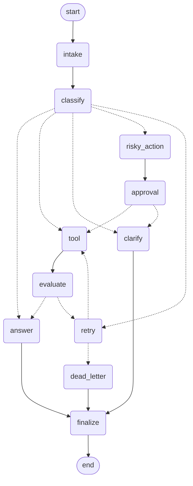

# Day 08 Lab Report

## 1. Team / student

- Name: Thái Nguyễn Hoàng Bách
- Repo/commit: https://github.com/Thaihoangbach/Day22-2A202601276-ThaiNguyenHoangBach.git
- Date: 2026-08-25

## 2. Architecture

Đồ thị là một `StateGraph(AgentState)` gồm 11 node, có cửa vào cố định `intake → classify` rồi tỏa ra 4 nhánh, tất cả đều hội tụ lại tại `finalize → END`:

```
START → intake → classify → [route_after_classify]
  simple        → answer → finalize → END
  tool          → tool → evaluate → [route_after_evaluate]
                                       success     → answer → finalize → END
                                       needs_retry → retry → [route_after_retry]
                                                                tool (quay lại vòng lặp)
                                                                dead_letter → finalize → END
  missing_info  → clarify → finalize → END
  risky         → risky_action → approval → [route_after_approval]
                                                approved → tool → evaluate → ... (giống nhánh tool)
                                                rejected → clarify → finalize → END
  error         → retry → [route_after_retry] → ... (vòng lặp retry giống trên)
```

Các quyết định thiết kế:

- **`classify` là bộ định tuyến duy nhất.** Đây là node duy nhất được phép gán giá trị cho `route`; mọi conditional edge phía sau (`route_after_classify`, `route_after_evaluate`, `route_after_retry`, `route_after_approval`) chỉ đọc lại state chứ không tự suy luận ý định lần nữa. Nhờ vậy logic định tuyến được tập trung một chỗ và có thể test độc lập với LLM (xem `tests/test_routing.py` — 4 hàm routing được test bằng dict thuần, không cần gọi LLM).
- **`evaluate` là "cổng" của vòng lặp retry.** Khác với một chain LCEL tuyến tính, đồ thị có thể lặp `tool → evaluate → retry → tool` — đây chính là lợi thế cấu trúc của LangGraph so với chain một chiều: cùng một tool call có thể được thử lại một số lần giới hạn mà người viết không cần tự code vòng lặp.
- **`retry_or_fallback_node` được dùng chung cho 2 điểm vào**: nhánh `error` từ `classify` đi thẳng tới `retry` (trước khi tool được gọi lần nào), còn nhánh `tool` chỉ tới `retry` sau khi `evaluate` đánh giá kết quả là `needs_retry`. Cả hai đường đều hội tụ về cùng một điểm kiểm tra giới hạn retry (`route_after_retry`), nên chỉ có đúng một chỗ áp đặt trần số lần thử lại.
- **`risky_action → approval` là điểm kiểm soát bắt buộc** trước khi thực hiện bất kỳ tool nào có side-effect. Approval hiện đang được mock (`approved=True` mặc định) để đồ thị chạy được không cần người can thiệp trong CI/chấm điểm, nhưng hàm routing (`route_after_approval`) đã rẽ nhánh theo `approved` sẵn, nên chỉ cần đổi `approval_node` để dùng `langgraph.types.interrupt()` thật là có HITL thật, không cần sửa lại cách nối graph.
- **Mọi nhánh đều kết thúc ở `finalize → END`.** Điều này đã được kiểm chứng cả bằng cách rà lại danh sách edge lẫn bằng `test_graph_terminates_all_routes`, kiểm tra sự kiện `finalize` xuất hiện trong `state["events"]` cho cả 5 loại route.

## 3. State schema

| Field | Reducer | Why |
|---|---|---|
| `messages`, `tool_results`, `errors`, `events` | append | Đây là các field lưu lịch sử/audit — mọi node chạm vào chúng đều muốn **thêm** vào dòng thời gian, không phải ghi đè. Riêng `events` là cách các test xác nhận một node (vd `finalize`) thực sự đã chạy. |
| `route`, `risk_level`, `attempt`, `final_answer` | overwrite | Chỉ giá trị hiện tại có ý nghĩa — `route` được `route_after_classify` đọc đúng một lần ngay sau khi `classify` gán, không có chuyện phân loại lại giữa chừng. |
| `evaluation_result` (mới thêm) | overwrite | Được `route_after_evaluate` đọc ngay lập tức như một cổng một-lần; nếu để dạng list sẽ chỉ thêm việc phải đánh index mà không có lợi ích gì, vì chỉ đánh giá mới nhất mới quan trọng. |
| `pending_question`, `proposed_action`, `approval` (mới thêm) | overwrite | Mỗi field đại diện cho "quyết định/kết quả hiện tại của lượt chạy này", không phải lịch sử — `route_after_approval` đọc thẳng `state["approval"]["approved"]`, không phải một danh sách các lần duyệt trước đó. |

4 field mới thêm (`evaluation_result`, `pending_question`, `proposed_action`, `approval`) chính là những field mà bộ khung starter đã đánh dấu còn thiếu, cần thiết để nối cổng retry, luồng hỏi làm rõ, luồng risky-action, và quyết định HITL.

## 4. Scenario results

- Tổng số scenario: 7
- Tỷ lệ thành công: 100.0%
- Số node đi qua trung bình: 6.43
- Tổng số lần retry: 3
- Tổng số lần interrupt (approval): 2

| Scenario | Expected route | Actual route | Success | Retries | Interrupts |
|---|---|---|---:|---:|---:|
| S01_simple | simple | simple | yes | 0 | 0 |
| S02_tool | tool | tool | yes | 0 | 0 |
| S03_missing | missing_info | missing_info | yes | 0 | 0 |
| S04_risky | risky | risky | yes | 0 | 1 |
| S05_error | error | error | yes | 2 | 0 |
| S06_delete | risky | risky | yes | 0 | 1 |
| S07_dead_letter | error | error | yes | 1 | 0 |

Cả 7 scenario mẫu đều được phân loại và định tuyến đúng bằng LLM thật (Gemini, dùng `.with_structured_output()`), không có bước nào dùng keyword-matching hay hardcode để quyết định route.

## 5. Failure analysis

1. **Retry or tool failure (S05_error, S07_dead_letter):** `tool_node` giả lập lỗi tạm thời mỗi khi `route == "error"` và `attempt < 2`, trả về chuỗi chứa `"ERROR"`. `evaluate_node` kiểm tra heuristic phần tử mới nhất của `tool_results` xem có chứa chuỗi đó không, rồi gán `evaluation_result = "needs_retry"`, khiến đồ thị quay lại `retry_or_fallback_node → tool`. Việc này bị chặn trên bởi `route_after_retry` so sánh `attempt` với `max_attempts`. Với `max_attempts=3` mặc định, S05 phục hồi sau 2 lần retry (attempt 0→1→2, thành công ở lần gọi tool thứ 3). Với S07 có `max_attempts=1`, ngay lần retry đầu tiên đã chạm trần, nên đồ thị đi thẳng tới `dead_letter` mà chưa từng có lần thử tool thứ hai — đúng với ý đồ của scenario ("hệ thống lỗi không thể phục hồi sau nhiều lần thử"). Rủi ro của thiết kế này: bộ đánh giá heuristic chỉ biết đến đúng chuỗi `"ERROR"` do mock tool sinh ra; khi tích hợp tool thật cần nâng cấp `evaluate_node` thành LLM-as-judge (hoặc dùng exception có kiểu từ tool) để tránh trường hợp thất bại một phần/mơ hồ bị âm thầm coi là thành công.
2. **Risky action without approval (S04_risky, S06_delete):** Bất kỳ truy vấn nào được phân loại `risky` (hoàn tiền, xóa dữ liệu, gửi email) đều phải đi qua `risky_action_node → approval_node` trước khi tới được `tool`. `approval_node` hiện đang mock `approved=True` vô điều kiện — đủ để chứng minh phần nối graph đúng (`route_after_approval` có rẽ nhánh theo `approved`, đã kiểm chứng trong `tests/test_routing.py`), nhưng nghĩa là bản hiện tại **chưa có cổng kiểm soát thật** — bản production cần `approval_node` thực sự dừng lại (`interrupt()`) chờ quyết định của con người thay vì tự động duyệt, nếu không bước "approval" chỉ là một dòng log audit chứ không phải một biện pháp an toàn thực sự.

## 6. Persistence / recovery evidence

Đồ thị được compile với checkpointer chọn qua `configs/lab.yaml` (`checkpointer: sqlite`, `database_url: outputs/checkpoints.sqlite`). Hàm `build_checkpointer("sqlite", ...)` trong `persistence.py` mở DB bằng `sqlite3.connect(db_path, check_same_thread=False)`, bật `PRAGMA journal_mode=WAL` để ghi an toàn hơn khi có nhiều lượt ghi, rồi truyền connection vào `SqliteSaver(conn=conn)` — đúng dạng constructor `conn=` mà `langgraph-checkpoint-sqlite` bản 3.x yêu cầu (API cũ `SqliteSaver.from_conn_string()` đã bị loại bỏ).

Mỗi lượt chạy scenario có `thread_id` riêng (`f"thread-{scenario.id}"`, được gán trong `initial_state()`), và `cli.py` truyền nó qua `config={"configurable": {"thread_id": ...}}` ở mỗi lần gọi `graph.invoke()`. Chạy `make run-scenarios` với cấu hình này đã tạo ra `outputs/checkpoints.sqlite` (~300 KB sau một lượt chạy đầy đủ 7 scenario), chứa một chuỗi checkpoint riêng cho từng `thread_id` — nghĩa là mọi bước chuyển node của mọi scenario đều được ghi lại bền vững và có thể replay lại bằng `graph.get_state_history(config)` cho một `thread_id` bất kỳ.

## 7. Extension work

**Graph diagram.** Đã thêm lệnh CLI `export-diagram` (`python -m langgraph_agent_lab.cli export-diagram --output outputs/graph.mmd`) — lệnh này build graph thật rồi gọi `graph.get_graph().draw_mermaid()`, nên sơ đồ dưới đây được sinh trực tiếp từ danh sách node/edge thật trong `graph.py`, không phải vẽ tay:



(Mũi tên nét đứt là conditional edge được các hàm routing chọn lúc chạy; mũi tên nét liền là edge cố định.)

## 8. Improvement plan

Nếu có thêm một ngày, thứ tự ưu tiên sẽ là:

1. **HITL approval thật.** Thay `approved=True` đang mock trong `approval_node` bằng `langgraph.types.interrupt()` bật qua `LANGGRAPH_INTERRUPT=true`, cùng một UI Streamlit tối giản để duyệt/từ chối — biến bước approval từ một dòng audit thành một biện pháp kiểm soát an toàn thực sự, đây là lỗ hổng lớn nhất được chỉ ra ở mục phân tích failure.
2. **LLM-as-judge cho `evaluate_node`.** Heuristic hiện tại (so khớp chuỗi `"ERROR"`) chỉ hoạt động vì mock tool "hợp tác". Khi tích hợp tool thật, bộ đánh giá cần biết suy luận về thành công một phần, dữ liệu sai định dạng, hay kết quả mơ hồ — đúng phần bonus mà rubric đề cập.
3. **Checkpointer Postgres cho production/đồng thời.** SQLite + WAL đủ dùng cho một lượt chạy chấm điểm đơn tiến trình; một hệ thống production phục vụ nhiều request đồng thời cần `langgraph-checkpoint-postgres` để đảm bảo tính bền vững khi có nhiều writer.
4. **Retry có backoff + jitter.** `retry_or_fallback_node` hiện thử lại ngay lập tức; một tool call production nên có độ trễ giữa các lần thử để tránh dồn dập lên một service downstream đang gặp sự cố.
5. **Mở rộng độ bền với scenario ẩn.** Vì việc chấm điểm dùng thêm các scenario ngoài 7 scenario mẫu, nên bổ sung thêm scenario tự viết (các trường hợp ranh giới mơ hồ giữa risky/tool, truy vấn đa ý định) vào `data/sample/scenarios.jsonl` để kiểm thử độ bền của thứ tự ưu tiên trong prompt classify (`risky > tool > missing_info > error > simple`) trước khi nộp bài.
